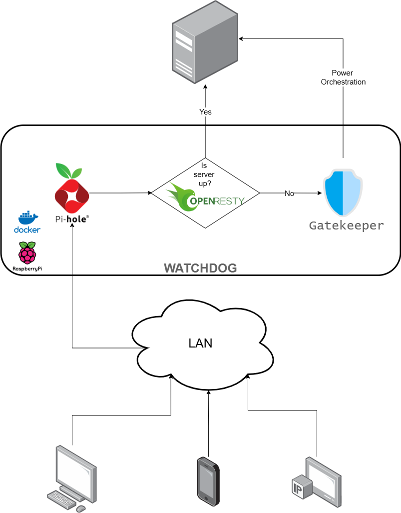

# Watchdog: A Secure Raspberry Pi Microserver Gateway for Private Cloud

A lightweight, containerised gateway designed for home-lab and private cloud environments. Watchdog runs reliably on single-board computers such as the Raspberry Pi 3B+ and provides secure intranet-only access, internal DNS resolution, conditional reverse proxy routing, and remote power orchestration.

---

## Features
- **Intranet-only access**: All services are confined to your local LAN.
- **Dynamic reverse proxy**: Requests are routed based on service availability using OpenResty (Nginx + Lua).
- **Internal DNS resolution**: Pi-hole resolves local service domains and blocks advertisements and telemetry.
- **Remote power control**: Supports Wake-on-LAN and secure shutdown for managed servers.
- **Containerised deployment**: Services are delivered as Docker containers for simplified maintenance.

---

## System Architecture Overview

- **Host Hardware**: Raspberry Pi 3B+ or any compatible hardware
- **Container Runtime**: Docker with Docker Compose
- **Network Access**: Local LAN (intranet) only



This setup is designed for **headless operation** and remote administration within a secured local network, enabling clean, modular service deployment using containers.

---

## Component Matrix

| Functionality               | Tool and Technology                              | Hosted On      |
|-----------------------------|--------------------------------------------------|----------------|
| Operating System            | Raspberry Pi OS Lite (64-bit)                    | Raspberry Pi   |
| Conditional Routing         | OpenResty (Nginx + Lua)                          | Raspberry Pi   |
| DNS Resolver                | Pi-hole                                          | Raspberry Pi   |
| Power Orchestration         | Wake-on-LAN, SSH or TCP Port Check & Streamlit   | Raspberry Pi   |
| Remote Shutdown             | SSH with key or API with token authenticated     | Raspberry Pi   |

---

## Supported Modes

Watchdog supports two distinct modes of operation for power orchestration and remote shutdown:

### 1. Generic Mode (Universal Linux Server)
Designed for any standard Linux server or desktop.
- **Wake-on-LAN**: Uses MAC address to wake any compatible server.
- **Remote Shutdown**: Uses SSH (with key authentication) to securely shut down any Linux server.
- **Requirements**:
   - Server must support Wake-on-LAN and be configured for it.
   - SSH access with appropriate privileges for issuing a `shutdown` command.

### 2. Proxmox Mode (Proxmox VE Integration)
Optimised for managing Proxmox Virtual Environment (VE) hosts.
- **Wake-on-LAN**: Same as generic mode.
- **Remote Shutdown**: Uses the Proxmox API with a dedicated API token for secure, granular power management.
- **Requirements**: 
   - A dedicated Proxmox API token with the `Sys.PowerMgmt` privilege.
   - No need for direct SSH access to the host.
Use the IS_PROXMOX=true setting in your .env file to enable this mode.
---

## How It Works
- **DNS**: Pi-hole resolves internal service names.
- **Reverse Proxy**: OpenResty uses Lua to check if the server is up:
  - If **up**: Requests are forwarded to the server or mapped services.
  - If **down**: Requests are routed to the Gatekeeper for status and Wake-on-LAN.
- **Wake-on-LAN**: Gatekeeper lets you wake the server if it is offline.
- **Remote Shutdown**:
  - **Generic**: Uses SSH with key authentication.
  - **Proxmox**: Uses Proxmox API with token authentication.

---

## Getting Started

The stack is containerized and can be easily deployed using Docker Compose. To deploy the entire stack on your preferred infrastructure, follow the instructions given below:

1. Clone the repository.
2. Create a `.env` file in the root directory before running `setup.sh`:
    ```bash
    # Pi-hole Configurations
    FTLCONF_dns_upstreams="" # DNS servers used by Pi-hole for upstream resolution (semicolon separated)
    FTLCONF_webserver_api_password="" # Password for accessing the Pi-hole admin web interface
    HOST_IP="" # IP address of the Raspberry Pi 3B+ host
    HOSTNAME="" # Hostname for the Pi-hole container
    PARENT_INTERFACE="" # Pi-hole network interface, defaults to `$(ip route | grep default | awk '{print $5}')` if not set
    PIHOLE_IP="" # Static IP address for the Pi-hole container
    PIHOLE_MAC="" # MAC address for the Pi-hole container
    SERVER_IP="" # Static IP address of server
    SERVER_MAC="" # MAC address of server
    SERVER_PORT="" # Port of server,  defaults to `22` if not set 
    IS_PROXMOX="" # Set to `true` if the server is a Proxmox host, defaults to `false` if not set 
    TZ="" # Your Timezone
    ```
3. Create a `99-custom-dns.conf` file with custom DNS records:
    - Each entry should be on a new line and the DNS records should be in the given format `address=/<DOMAIN_NAME>/<IP_ADDRESS>`
4. Create a `services.json` file with services for conditional routing:
    - The file should be a valid JSON object where each key is a service hostname and the value is an object defining the target address.

    ```json
    {
        "service.hostname": {"target": "<IP_ADDRESS>:<PORT>"},
        ...
    }
    ```
    - The keys must match the exact hostname used in requests.
    - The `target` value specifies the backend IP and port for that service.
5. Run the setup script as root.
    - This script will:
      - Install Docker and Docker Compose
      - Configure environment variables
      - Launch all defined services

6. Setting up the targets:

   6.1. Generic Mode 

   Use the [`setup-linux-host.sh`](target/setup-linux-host.sh) script to configure a standard Linux host with SSH-based remote shutdown support.

   - Transfer the setup script to the target machine.
   - Execute the script as root.
   - When prompted, paste your SSH public key. This key will be restricted to executing only the `shutdown now` command.
   - The script will:
      - Create a system user named `gatekeeper`
      - Configure the `authorized_keys` with command-only access
      - Grant passwordless shutdown rights to 'gatekeeper' using sudoers

   Once complete, the host will be ready to accept secure remote shutdown commands over SSH.

   6.2. Proxmox Mode

   Use the [`setup-proxmox-host.sh`](target/setup-proxmox-host.sh) script to configure a Proxmox VE node for remote shutdown via the Proxmox API.

   - Transfer the setup script to the target machine.
   - Execute the script as root.
   - The script will:
      - Create the Proxmox user `gatekeeper@pve`
      - Generate an API token named `shutdown` and show its token ID and secret
      - Create a role and group named `gatekeeper` with `Sys.PowerMgmt` privileges only
      - Assign the role to the user via the group
   - Store the token secret securely. This will be required by the Watchdog client for authenticated shutdown requests.
   
   Once complete, the Proxmox host will be ready to receive secure remote shutdown instructions via its API.
---