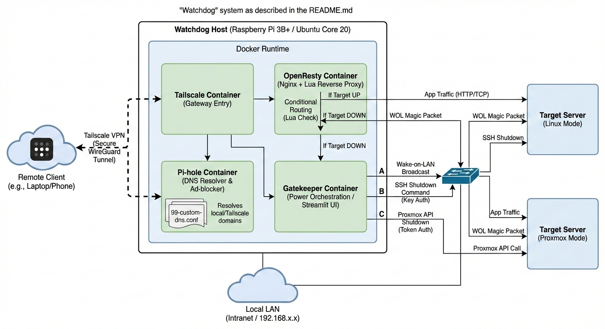

# Watchdog: Secure Tailscale Gateway for Private Cloud

A lightweight, containerised gateway designed for private cloud environments. It deploys reliably on single-board computers, such as the Raspberry Pi 3B+, and provides secure Tailscale networking, split DNS resolution via Pi-hole, conditional reverse proxy routing with OpenResty, and remote power orchestration capabilities.

## Features
- **Secure Tailscale networking**: Provides a unified service namespace with integrated networking, enabling zero configuration remote access while preventing direct exposure to the local area network.
- **Dynamic reverse proxy**: Requests are routed based on service availability using OpenResty (Nginx + Lua).
- **DNS resolution**: Pi-hole resolves local service domains, serves Tailscale tailnet queries and blocks advertisements and telemetry across both networks.
- **Remote power control**: Supports Wake-on-LAN broadcasts and secure shutdown via SSH or API.
- **Containerised deployment**: Services are delivered as Docker containers for simplified maintenance.

## System Architecture Overview

- **Host Hardware**: Raspberry Pi 3B+ or any compatible hardware
- **Container Runtime**: Docker with Docker Compose
- **Network Access**: Local LAN (intranet) only

The system operates in **headless mode**, with access restricted exclusively to Tailscale clients.



> _Image generated by Gemini Nano Banana Pro_

## Component Matrix

| Functionality               | Tool and Technology                              | Hosted On      |
|-----------------------------|--------------------------------------------------|----------------|
| Operating System            | Ubuntu Core 20                                   | Raspberry Pi   |
| Conditional Routing         | OpenResty (Nginx + Lua)                          | Raspberry Pi   |
| DNS Resolver                | Pi-hole                                          | Raspberry Pi   |
| Power Orchestration         | Wake-on-LAN, SSH or TCP Port Check & Streamlit   | Raspberry Pi   |
| Remote Shutdown             | SSH with key or API with token authenticated     | Raspberry Pi   |
| Secure Networking           | Tailscale                                        | Raspberry Pi   |


## Supported Modes

Watchdog supports two distinct modes of operation for power orchestration and remote shutdown:

### 1. Linux Distribution Mode
Designed for any standard Linux server or desktop.
- **Wake-on-LAN**: Uses MAC address to wake any compatible server.
- **Remote Shutdown**: Uses SSH (with key authentication) to securely shut down any Linux server.
- **Requirements**:
   - Server must support Wake-on-LAN and be configured for it.
   - SSH access with appropriate privileges for issuing a `shutdown` command.
- **Supported Distributions:**
   - [openSUSE MicroOS](target/setup-opensuse-microos-host.sh)
   - [Ubuntu Server 24.04.2 LTS](target/setup-ubuntu-server-24.04.2-lts-host.sh)

### 2. Proxmox Mode (Proxmox VE Integration)
Optimised for managing Proxmox Virtual Environment (VE) hosts.
- **Wake-on-LAN**: Same as generic mode.
- **Remote Shutdown**: Uses the Proxmox API with a dedicated API token for secure, granular power management.
- **Requirements**: 
   - A dedicated Proxmox API token with the `Sys.PowerMgmt` privilege.
   - No need for direct SSH access to the host.
Use the IS_PROXMOX=true setting in your .env file to enable this mode.

## How It Works
- **DNS**: Pi-hole resolves DNS queries for both, LAN domains (using direct IPs) and Tailscale tailnet resources (using tailnet IPs) through split configuration and custom records.
- **Reverse Proxy**: OpenResty uses Lua to check if the server is up:
  - If **up**: Requests are forwarded to the server or mapped services.
  - If **down**: Requests are routed to the Gatekeeper for status and Wake-on-LAN.
- **Wake-on-LAN**: Gatekeeper lets you wake the server if it is offline.
- **Remote Shutdown**:
  - **Generic**: Uses SSH with key authentication.
  - **Proxmox**: Uses Proxmox API with token authentication.

## Getting Started

> **_Deployment requires a two-phase process. The HOST_IP (Tailscale IP of the Watchdog) is assigned only after successful Tailscale container authentication and is unavailable initially. Phase 1 uses placeholders to retrieve it; Phase 2 applies full configuration._**

> _Docker and Docker Compose must be installed on the host prior to deployment._

### Phase 1: Initial Deployment (Acquire Tailscale IP)

1. Clone the repository.

2. Create a `.env` file in the root directory:
    ```bash
    FTLCONF_dns_upstreams="" # DNS servers used by Pi-hole for upstream resolution (semicolon separated)
    FTLCONF_webserver_api_password="" # Password for accessing the Pi-hole admin web interface
    HOST_IP="placeholder" # Tailscale IP address of the Raspberry Pi 3B+ host
    HOSTNAME="" # Hostname for the Tailscale container
    HOST_PARENT_INTERFACE="" # Host network interface, run command on the host to find the value `ip route | grep default | awk '{print $5}'`
    SERVER_IP="" # Tailscale IP address of server
    SERVER_MAC="" # MAC address of server
    SERVER_PORT="" # Port of server
    IS_PROXMOX="" # Set to `true` if the server is a Proxmox host, `false` otherwise
    TS_AUTHKEY="" # Tailscale authentication key. Generate from `https://login.tailscale.com/admin/settings/keys`
    TZ="" # Your Timezone
    WATCHDOG_IP="" # Local IP address for the Watchdog container
    WATCHDOG_MAC="" # MAC address for the Watchdog container
    ```
3. Create a placeholder for `99-custom-dns.conf` and `services.json` files.

4. Execute `docker compose up -d` to launch the stack.

5. Approve device in [Tailscale admin console](https://login.tailscale.com/admin/machines) and note the Tailscale IP of the Watchdog.

### Phase 2: Full Configuration and Redeployment

1. Update the `HOST_IP` element in `.env` file.

2. Update the `99-custom-dns.conf` file with custom DNS records:
    - Each entry should be on a new line and the DNS records should be in the given format 
      ```conf
      address=/<SERVICE_DOMAIN_NAME>/<HOST_IP>
      ```
4. Update the `services.json` file with services for conditional routing:
    - The file should be a valid JSON object where each key is a service hostname and the value is an object defining the target address.
      ```json
      {
         "SERVICE_DOMAIN_NAME": {"target": "<SERVER_IP>:<PORT>"},
         ...
      }
      ```
    - The keys must match the exact hostname used in requests.
    - The `target` value specifies the backend IP and port for that service.

5. Run `docker compose down && docker compose up -d`.

6. In the Tailscale admin console, configure the Pi-hole Tailscale IP as the nameserver with "Override local DNS" enabled. [Click for details](#pi-hole-split-dns-configuration).

## Setting Up The Targets

1. Linux Distribution Mode

   Use the applicable [`targer script`](target/) to configure a Linux host with SSH-based remote shutdown support.

   - Transfer the setup script to the target machine.
   - Execute the script as root.
   - When prompted, paste your SSH public key. This key will be restricted to executing only the `shutdown now` command.
   - The script will:
      - Create a system user named `gatekeeper`
      - Configure the `authorized_keys` with command-only access
      - Grant passwordless shutdown rights to 'gatekeeper' using sudoers

   Once complete, the host will be ready to accept secure remote shutdown commands over SSH.

2. Proxmox Mode

   Use the [`setup-proxmox-host.sh`](target/setup-proxmox-host.sh) script to configure a Proxmox VE node for remote shutdown via the Proxmox API.

   - Transfer the setup script to the target machine.
   - Execute the script as root.
   - The script will:
      - Create the Proxmox user `gatekeeper@pve`
      - Generate an API token named `shutdown` and show its token ID and secret
      - Create a role and group named `gatekeeper` with `Sys.PowerMgmt` privileges only
      - Assign the role to the user via the group
   - Store the token secret securely. This will be required by the Watchdog client for authenticated shutdown requests.
   
   Once complete, the Proxmox host will be ready to receive secure remote shutdown instructions via its API.

## Pi-hole Split DNS Configuration

1. Configure LAN devices via DHCP or router to use the Pi-hole LAN IP as their DNS server.

2. Tailscale Admin Console Configuration:

   2.1. Navigate to `DNS > Nameservers > Add nameserver > Custom`

   2.2. Nameserver: Enter the Pi-hole Tailscale IP as the IPv4 address for name resolution.

   2.3. Restrict to domain: Enable this option and add your service domain.

   2.4. Use with exit node: Disable this option to ensure the nameserver applies independently of exit nodes.

   2.5. Save the configuration.