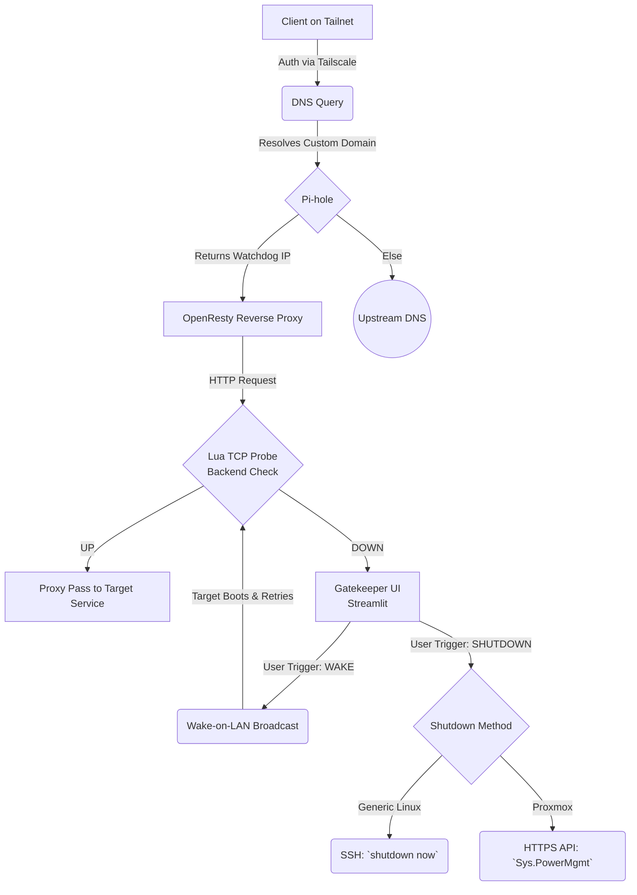

# Watchdog Gateway Architecture

The Watchdog Gateway acts as a secure access and power orchestration control point for local network services. Hosted entirely on a Raspberry Pi, it uses secure overlay networking to mediate client access, conditionally routing traffic based on the target server's power state, and providing automated wake/sleep capabilities.

---

## 1. Roles

**Raspberry Pi**

* Hosts DNS resolver, reverse proxy and orchestration logic.
* Acts as the only ingress node for service domains.
* Executes runtime health checks and power control actions.

**Ubuntu Core 20**

* Immutable, transactional OS providing operational stability.
* Constrains services within snap based confinement.

**Tailscale**

* Establishes encrypted WireGuard based mesh connectivity.
* Restricts service access to authenticated tailnet members.
* Eliminates direct WAN exposure of internal hosts.

**Pi-hole**

* Centralised DNS control point.
* Overrides specific service domains to resolve to the gateway.

**OpenResty**

* Performs reverse proxying.
* Executes Lua logic for backend reachability checks.
* Implements deterministic conditional routing.

---

## 2. Control and Data Flow

### Step 1: Client Access Initiation
* **Connection:** A client joins the Tailnet and is authenticated via Tailscale.
* **Request:** The client sends a DNS query for a specific local service domain.

### Step 2: DNS Resolution
All service traffic converges on the gateway through centralized DNS management.
* **Pi-hole Evaluation:** * *Match:* If the domain matches a custom DNS record, Pi-hole returns the Watchdog's Tailscale IP address.
    * *No Match:* The query is forwarded to an upstream DNS provider.

### Step 3: Reverse Proxy Processing
OpenResty receives the incoming HTTP request and utilizes a Lua script to determine the next routing step.
* **Health Check:** The Lua script performs a TCP probe against `<SERVER_IP>:<PORT>` to determine the backend state.
* **Decision:**
    * *Backend Reachable (UP):* Traffic is proxy-passed directly to the target service.
    * *Backend Unreachable (DOWN):* Traffic is routed to the Gatekeeper (Power Orchestration UI).

### Step 4: Power Orchestration Branch (Wake)
If the backend is offline, the user interacts with the Gatekeeper interface.
* **Trigger:** The user initiates a "Wake" action.
* **Execution:** A Wake-on-LAN (WoL) magic packet is broadcast, booting the target server.
* **Resolution:** Once the target server comes online, subsequent client requests will pass the Lua TCP probe, and traffic will route normally.

### Step 5: Remote Shutdown Flow
Shutdown commands can be triggered via the Gatekeeper UI through two distinct paths depending on the target system:
* **Generic Linux:** Connects via SSH (using key authentication and a forced command) to execute `shutdown now`.
* **Proxmox Mode:** Makes an HTTPS API call (using token authentication) to trigger a `Sys.PowerMgmt` shutdown action.

---

## 3. Logical Flow Diagram

## 4. Constraints and Limitations

1. Single point of failure:
   The Raspberry Pi acts as DNS override authority and reverse proxy ingress. High availability requires replication or failover design.

2. TCP health checks:
   Port reachability does not guarantee application readiness. Application layer health endpoints may provide stronger guarantees.

3. Wake-on-LAN:
   Requires BIOS or firmware support and L2 broadcast availability.

4. Overlay dependency:
   All access depends on Tailscale availability and identity control plane.

Confidence level: high for architectural consistency; medium for resilience under large scale load without empirical benchmarking. Further validation through load testing, failover simulation and threat modelling is recommended.